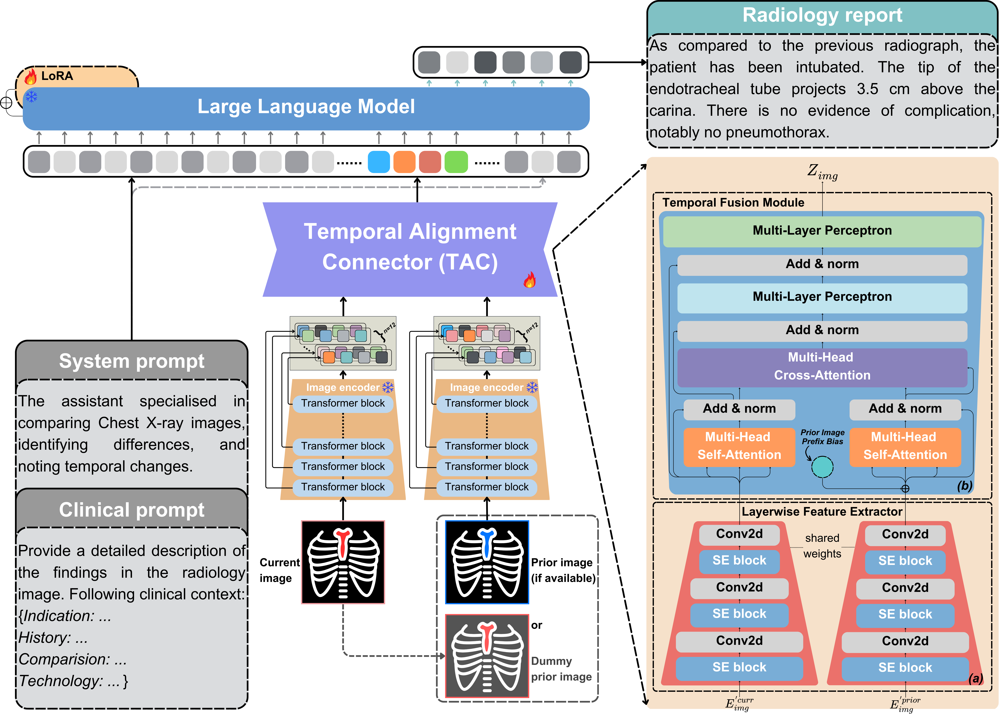
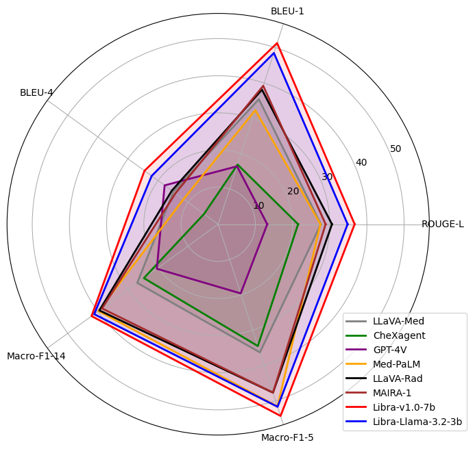
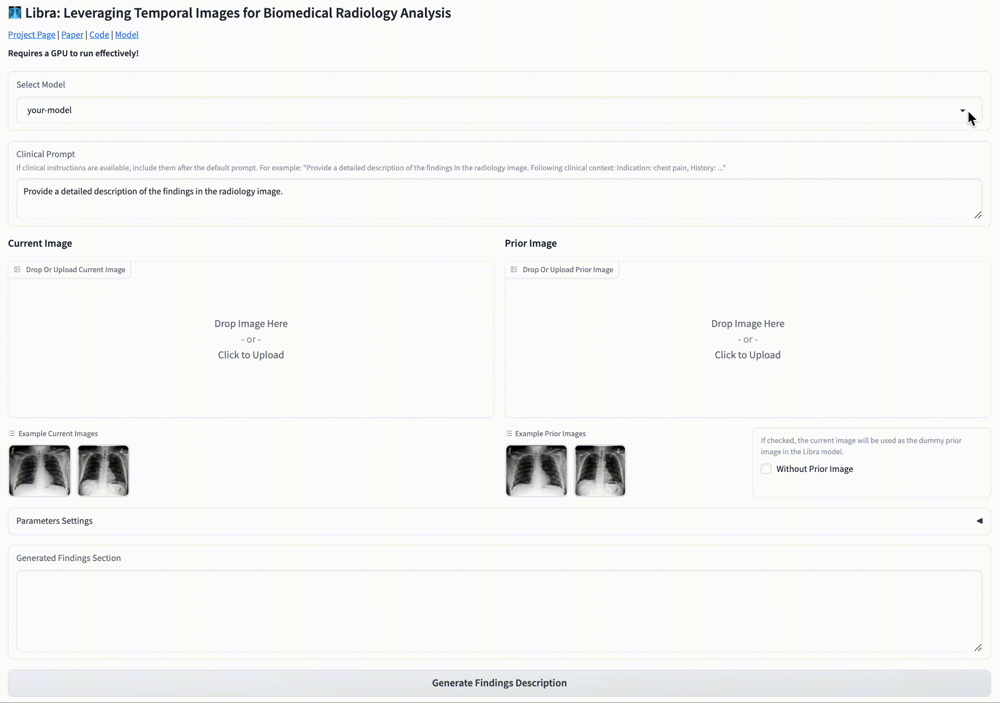

<h1 align="center">
  
  <strong>Libra: Leveraging Temporal Images for Biomedical Radiology Analysis</strong>
</h1>

<div align="center">

[](https://rexrank.ai/)
[](https://x-izhang.github.io/Libra_v1.0/)
[](https://deepwiki.com/X-iZhang/Libra)
[](https://huggingface.co/spaces/X-iZhang/Libra)
[](https://huggingface.co/collections/X-iZhang/libra-6772bfccc6079298a0fa5f8d)
[](https://huggingface.co/datasets/X-iZhang/MIMIC-CXR-RRG)
[](https://arxiv.org/abs/2411.19378) 
[](https://github.com/X-iZhang/Libra/blob/main/LICENSE)
[](https://visitorbadge.io/status?path=https%3A%2F%2Fgithub.com%2FX-iZhang%2FLibra)
<!-- [](https://star-history.com/#X-iZhang/Libra) -->
</div>

*This repository hosts **Libra**, a tool designed to generate radiology reports by leveraging temporal information from chest X-rays taken at different time points.*

<details open><summary>📢 More Than Radiology: Codespace Features for MLLMs Workflow You’ll Love! 🎉 </summary><p>

>  * **Support for LLaVA-Type, Qwen2/3, LLaMA 3, Mistral, Phi-3/4 & Gemma, as well as various visual encoders (DINO, CLIP, BiomedCLIP, SigLip):** Effortlessly run and fine-tune a variety of advanced open models.
>  * **Resume Training**: Resume training from checkpoints at any stage, whether for pre-training or fine-tuning.  
>  * **Validation Dataset**: Track model performance in real-time on `validation datasets` during training. 
>  * **Custom Metrics**: Go beyond `eval_loss` with metrics like `BLEU`, `ROUGE-L`, `RadGraph-F1` or define your own criteria on valid dataset.   
>  * **Smart Saving**: Automatically save the best model based on validation loss or custom evaluation scores.

</p></details>

## 🔥 News
- **[4 Oct 2025]** 🛠️ Updated the batch inference function `libra_eval_batch`— see [Batch Inference Guide](https://github.com/X-iZhang/Libra?tab=readme-ov-file#-batch-inference).
- **[27 Sep 2025]** 📷 [**CCD: Clinical Contrastive Decoding**](https://x-izhang.github.io/CCD/) is out! A *plug-and-play, training-free* decoding framework to boost any SOTA radiology MLLM!
- **[20 Jul 2025]** ✅ Support for [LLaVA-Rad](https://huggingface.co/microsoft/llava-rad) is added. [**Compatible weights**](https://github.com/X-iZhang/Libra/tree/main?tab=readme-ov-file#compatible-weights) are now available.
- **[15 Jul 2025]** ✅ Support for [MAIRA-2](https://huggingface.co/microsoft/maira-2) is added. [**Compatible weights**](https://github.com/X-iZhang/Libra/tree/main?tab=readme-ov-file#compatible-weights) are provided for benchmarking, with 'use_maira_feature_norm: true' set to ensure compatibility with the default feature extraction strategy.
- **[14 Jul 2025]** 🩺 For evaluating AI-generated radiology text, we recommend using 👉 [**RadEval**](https://pypi.org/project/RadEval/).
- **[9 Jul 2025]** 🚚 The test dataset is now available on Hugging Face — check out [**./MIMIC-CXR-RRG**](https://huggingface.co/datasets/X-iZhang/MIMIC-CXR-RRG). It includes `findings, impression, indication, comparison, technique, history, and examination` sections, processed according to the official MIMIC-CXR guidelines.
- **[18 Jun 2025]** 🎤 Invited talk at [**HealTAC 2025**](https://healtac2025.github.io/programme/) — topic: [*Towards Temporal-Aware Multimodal Large Language Models for Improved Radiology Report Generation*](https://x-izhang.github.io/post/healtac2025/)
- **[16 May 2025]** 📝 A short blog: some musings on [***"What Does ‘Temporal’ Really Mean?”***](https://x-izhang.github.io/blog/libra-blog1/) — thoughts behind Libra and temporal reasoning in radiology.
- **[15 May 2025]** 🥳 [***The paper***](https://arxiv.org/pdf/2411.19378v2) has been accepted to [**ACL 2025**](https://2025.aclweb.org/)!
- **[09 May 2025]** ✨ Now with full support for the [Phi-4](https://huggingface.co/collections/microsoft/phi-4-677e9380e514feb5577a40e4) family — compact language and reasoning models from Microsoft.
- **[24 Mar 2025]** 🏆 **Libra** was invited to the [**ReXrank**](https://rexrank.ai/) Challenge — a leading leaderboard for Chest X-ray Report Generation.

<details>
<summary>- More -</summary>

- **[10 Mar 2025]**  ✅ The architecture of [LLaVA-Med v1.5](https://huggingface.co/microsoft/llava-med-v1.5-mistral-7b) is now supported by this repo. [**Compatible weights**](https://github.com/X-iZhang/Libra/tree/main?tab=readme-ov-file#compatible-weights) are provided, with 'unfreeze_mm_vision_tower: true' set to ensure the *adapted* vision encoder is used.
- **[11 Feb 2025]** 🚨 [**Libra-v1.0-3b**](https://huggingface.co/X-iZhang/libra-v1.0-3b) has been released! A **Small Multimodal Language Model for Radiology Report Generation**,  following the same training strategy as **Libra**.
- **[10 Feb 2025]** 🚀 The [**Libra**](https://github.com/X-iZhang/Libra) repo now supports [Mistral](https://huggingface.co/mistralai), [Phi-3](https://huggingface.co/collections/microsoft/phi-3-6626e15e9585a200d2d761e3), and [Gemma](https://huggingface.co/collections/google/gemma-2-release-667d6600fd5220e7b967f315) as LLMs, along with [SigLip](https://huggingface.co/collections/google/siglip-659d5e62f0ae1a57ae0e83ba) as the encoder!
- **[19 Jan 2025]** ⚡ The **online demo** is available at [Hugging Face Demo](https://huggingface.co/spaces/X-iZhang/Libra). Welcome to try it out!
- **[07 Jan 2025]** 🗂️ The processed data is available at [Data Download](https://github.com/X-iZhang/Libra#data-download).
- **[20 Dec 2024]** 🚨 [**Libra-v1.0-7b**](https://huggingface.co/X-iZhang/libra-v1.0-7b) has been released!

</details>


## Overview
Radiology report generation requires integrating temporal medical images and creating accurate reports. Traditional methods often overlook crucial temporal information. We introduce **Libra**, a temporal-aware MLLM for chest X-ray report generation. Libra combines a radiology-specific image encoder with a novel **`Temporal Alignment Connector (TAC)`**, designed to accurately capture and integrate temporal differences between paired current and prior images. Experiments show that Libra sets new performance benchmarks on the MIMIC-CXR dataset for the RRG task.

<details open>
<summary>Libra’s Architecture</summary>



</details>

## Contents
- [Install](#install)
- [Model Weights](#model-weights)
    - [Libra-v1.0](#libra-v10)
    - [Libra-v0.5](#libra-v05)
    - [Compatible weights](#compatible-weights)
    - [Projector weights](#projector-weights)
- [Quick Start](#quick-start)
    - [Gradio Web UI](#gradio-web-ui)
    - [CLI Inference](#cli-inference)
    - [Script Inference](#script-inference)
    - [✨Batch Inference](#-batch-inference)
- [Dataset](#dataset)
    - [Data Download](#data-download)
- [Train](#train)
    - [Hyperparameters](#hyperparameters)
    - [Stage 1: visual feature alignment](#stage-1-visual-feature-alignment)
    - [Stage 2: RRG downstream task fine-tuning](#stage-2-rrg-downstream-task-fine-tuning)
    - [✨New Options to Note](#-new-options-to-note)
- [Evaluation](#evaluation)
    - [Generate model responses](#1-generate-libra-responses)
    - [Evaluate the generated report](#2-evaluate-the-generated-report)
    - [Metrics](#metrics)

## Install
> [!TIP]
> We strongly recommend that you create an environment from scratch as follows:

### Option 1:
Install the most up-to-date version directly from GitHub for quick use:
```bash
pip install git+https://github.com/X-iZhang/Libra.git
```

### Option 2: 
If you want to modify the code, you can clone the repository and install it in editable mode:

1. Clone this repository and navigate to Libra folder
```bash
git clone https://github.com/X-iZhang/Libra.git
cd Libra
```

2. Install Package
```Shell
conda create -n libra python=3.10 -y
conda activate libra
pip install --upgrade pip  # enable PEP 660 support
pip install -e .
```

3. Install additional packages for Training and Evaluation cases
```Shell
pip install -e ".[train,eval]"
pip install flash-attn --no-build-isolation
```

<details>
<summary> Upgrade to latest code base </summary>

```Shell
git pull
pip install -e .
```

</details>

## Model Weights

<p align="center">
   <br>
  Libra-v1.0 achieves SoTA performance.
</p>

### Libra-v1.0
| Version | Size | Projector | Base LLM | Vision Encoder| Checkpoint |
| ----------- | ----------- | ----------- | ----------- | ----------- | ----------- |
| Libra-1.0 | 7B | TAC | Meditron-7B | RAD-DINO | [libra-v1.0-7b](https://huggingface.co/X-iZhang/libra-v1.0-7b) |
| Libra-1.0 | 3B | TAC | Llama-3.2-3B-Instruct| RAD-DINO | [libra-v1.0-3b](https://huggingface.co/X-iZhang/libra-v1.0-3b) |


<details>
<summary> Performance on MIMIC-CXR (Findings section) </summary>

| Model | BLEU1 | BLEU4 | METEOR | ROUGE-L | RaTEScore | RG_ER |
|----------|----------|-----------|-----------|---|---|---|
| Libra-v1.0-7b | 51.3| 24.5 | 48.9 | 36.7 | 61.5 | 37.6 |
| Libra-v1.0-3b | 50.5 | 23.3 | 48.5 | 35.2 | 61.1 | 37.5 |
| Med-CXRGen-F | 37.3 | 10.3 | 35.6 | 24.0 | 53.7 | 23.8 |

</details>

### Libra-v0.5

| Version | Size | Projector | Base LLM | Vision Encoder| Checkpoint |
| ----------- | ----------- | ----------- | ----------- | ----------- | ----------- |
| Libra-0.5 | 7B | MLP-2x | Vicuna-7B | CLIP-L-336px | [Med-CXRGen-F](https://huggingface.co/X-iZhang/Med-CXRGen-F) |
| Libra-0.5 | 7B | MLP-2x | Vicuna-7B | CLIP-L-336px | [Med-CXRGen-I](https://huggingface.co/X-iZhang/Med-CXRGen-I) |

> [!NOTE]
> *These two models are fine-tuned for `Findings` and `Impression` section generation. For more information on training strategies and dataset collection, please refer to [Med-CXRGen (Gla-AI4BioMed at RRG24)](https://github.com/X-iZhang/RRG-BioNLP-ACL2024)*

### Compatible weights

| Version | Size | Projector | Base LLM | Vision Encoder| Checkpoint |
| ----------- | ----------- | ----------- | ----------- | ----------- | ----------- |
| Llava-Med | 7B | MLP-2x | Mistral-7B-Instruct-v0.2 | CLIP-L-336px (adapted) | [Llava-Med-v1.5](https://huggingface.co/X-iZhang/libra-llava-med-v1.5-mistral-7b) |
| Llava-Rad | 7B | MLP-2x | Vicuna-7B | BiomedCLIP (adapted) | [LLaVA-Rad](https://huggingface.co/X-iZhang/libra-llava-rad) |
| MAIRA | 7B | MLP-4x | Vicuna-7B | RAD-DINO (adapted) | [MAIRA-2](https://huggingface.co/X-iZhang/libra-maira-2) |

> [!NOTE]
> - *To use Llava-Med-v1.5, set `conv_mode = llava_med_v1.5_mistral_7b`*
> - *To use LLaVA-Rad, set `conv_mode = v1`* 
> - *To use MAIRA-2, set `conv_mode = maira_2`*

<details>
<summary>❗️MAIRA-2 requires a strict chat prompt format and must be manually constructed. <i>(Click to show example)</i></summary>

```python
# ✅ With clinical instruction
prompt_with_clinical = (
    "Provide a description of the findings in the radiology study in comparison to the prior frontal image. "
    "INDICATION: Dyspnea. TECHNIQUE: PA and lateral views of the chest. COMPARISON: None."
)

# ✅ Without clinical instruction — all placeholders (INDICATION, TECHNIQUE, COMPARISON) and default prompt must still be present
prompt_minimal = (
    "Provide a description of the findings in the radiology study in comparison to the prior frontal image. "
    "INDICATION: None. TECHNIQUE: None. COMPARISON: None."
)

# 🧪 Example usage (following official MAIRA-2 format)
from libra.eval import libra_eval

frontal_image_url = "https://openi.nlm.nih.gov/imgs/512/145/145/CXR145_IM-0290-1001.png"
model_path = "X-iZhang/libra-maira-2"

answer = libra_eval(
    model_path=model_path,
    image_file=[frontal_image_url],
    query=prompt_with_clinical,
    conv_mode="maira_2",
    temperature=0.0,         # Use greedy decoding
    max_new_tokens=300,
)

# ✅ Expected output
print(answer)
# > There is a large right pleural effusion. No pneumothorax is identified. 
# > There is no left pleural effusion. There is no focal consolidation. 
# > The cardiomediastinal silhouette is within normal limits.
```

</details>

### Projector weights

These projector weights were pre-trained for visual instruction tuning on chest X-ray to text generation tasks. They can be directly used to initialise your model for multimodal fine-tuning in similar clinical domains.

⚠️ Important Note: For compatibility, please ensure that the *projector type*, *base LLM*, *conv_mode*, and *vision encoder* exactly match those used in our projector pretraining setup. Please also ensure the following settings are correctly configured during instruction tuning:

```Shell
--mm_projector_type TAC \ # or mlp2x_gelu
--mm_vision_select_layer all \ # or -2
--mm_vision_select_feature patch \
--mm_use_im_start_end False \
--mm_use_im_patch_token False \
```

| Base LLM | conv_mode | Vision Encoder | Projector | Pretrain Data | Download |
| ----------- | ----------- | ----------- | ----------- | ----------- | ----------- |
| Meditron-7B | libra_v1 | RAD-DINO | TAC | [RRG & VQA](https://physionet.org/content/mimic-cxr) | [projector](https://huggingface.co/X-iZhang/libra-v1.0-7b/resolve/main/mm_tac_projector.bin) |
| Llama-3.2-3B-Instruct | libra_llama_3 | RAD-DINO | TAC | [RRG & VQA](https://physionet.org/content/mimic-cxr) | [projector](https://huggingface.co/X-iZhang/libra-v1.0-3b/resolve/main/mm_tac_projector.bin) |
| Vicuna-7B| libra_v0 | CLIP-L-336px| MLP-2x | [Findings section](https://huggingface.co/datasets/StanfordAIMI/rrg24-shared-task-bionlp) | [projector](https://huggingface.co/X-iZhang/Med-CXRGen-F/resolve/main/mm_mlp2x_projector_findings.bin) |
| Vicuna-7B | libra_v0 | CLIP-L-336px | MLP-2x | [Impression section](https://huggingface.co/datasets/StanfordAIMI/rrg24-shared-task-bionlp) | [projector](https://huggingface.co/X-iZhang/Med-CXRGen-I/resolve/main/mm_mlp2x_projector_impressions.bin) |
| Mistral-7B-Instruct-v0.2| llava_med_v1.5_mistral_7b | CLIP-L-336px | MLP-2x | [LLaVA-Med Dataset](https://github.com/microsoft/LLaVA-Med?tab=readme-ov-file#llava-med-dataset) | [projector](https://huggingface.co/X-iZhang/libra-llava-med-v1.5-mistral-7b/resolve/main/mm_mlp2x_projector_llavamed.bin?download=true) |

## Quick Start

### Gradio Web UI

Launch a local or online web demo by running:

```bash
python -m libra.serve.app
```

<details>
<summary>Specify your model:</summary>

```bash
python -m libra.serve.app --model-path /path/to/your/model
```
</details>

You just launched the Gradio web interface. Now, you can open the web interface with the URL printed on the screen. You will notice that both the default `libra-v1.0` model and `your model` are available in the model list, and you can choose to switch between them.



### CLI Inference
We support running inference using the CLI. To use our model, run:
```Shell
python -m libra.serve.cli \
    --model-path X-iZhang/libra-v1.0-7b \
    --image-file "./path/to/current_image.jpg" "./path/to/previous_image.jpg"
    # If there is no previous image, only one path is needed.
```

### Script Inference
You can use the `libra_eval` function in `libra/eval/run_libra.py` to easily launch a model trained by yourself or us on local machine or in Google Colab, after installing this repository.

```Python
from libra.eval import libra_eval

# Define the model path, which can be a pre-trained model or your own fine-tuned model.
model_path = "X-iZhang/libra-v1.0-7b"  # Or your own model

# Define the paths to the images. The second image is optional for temporal comparisons.
image_files = [
    "./path/to/current/image.jpg", 
    "./path/to/previous/image.jpg"  # Optional: Only include if a reference image is available
]

# Define the prompt to guide the model's response. Add clinical instructions if needed.
prompt = (
    "Provide a detailed description of the findings in the radiology image. "
    "Following clinical context: ..."
)

# Specify the conversational mode, matching the PROMPT_VERSION used during training.
conv_mode = "libra_v1"

# Call the libra_eval function.
libra_eval(
    model_path=model_path,
    image_file=image_files,
    query=prompt,
    temperature=0.9,
    top_p=0.8,
    conv_mode=conv_mode,
    max_new_tokens=512
)
```
<details>
<summary>Meanwhile, you can use the Beam Search method to obtain output.</summary>

```Python
libra_eval(
    model_path=model_path,
    image_file=image_files,
    query=prompt,
    num_beams=5, 
    length_penalty=2,
    num_return_sequences=2,
    conv_mode=conv_mode,
    max_new_tokens=512
)
```

</details>

<details>
<summary>Additionally, you can directly use LoRA weights for inference.</summary>

```Python
libra_eval(
    model_path="./path/to/lora_weights",  # path to LoRA weights
    model_base="./path/to/base_model",  # path to base Libra model
    image_file=image_files,
    query=prompt,
    num_beams=5, 
    length_penalty=2,
    num_return_sequences=2,
    conv_mode=conv_mode,
    max_new_tokens=512
)
```

</details>

### ✨ Batch Inference

>[!IMPORTANT]
>Now, we provide a simple batch inference function `libra_eval_batch` to facilitate the evaluation of multiple samples. This function is particularly useful for assessing model performance on datasets like MIMIC-CXR. Below is an example of how to use it:

```Python
# --- Import necessary libraries ---
from libra.eval.run_libra import load_model
from libra.eval import libra_eval_batch
from datasets import load_dataset

# --- Set up the model ---
model_path = "X-iZhang/libra-v1.0-7b"
# model_path = "X-iZhang/libra-v1.0-3b"
# model_path = "X-iZhang/Med-CXRGen-F"
# model_path = "X-iZhang/Med-CXRGen-I"
# model_path = "X-iZhang/libra-llava-med-v1.5-mistral-7b"
# model_path = "X-iZhang/libra-maira-2"
# model_path = "X-iZhang/libra-llava-rad"
reuse_model = load_model(model_path)
print('Load model success')

# --- load dataset and prepare images and queries ---
# Load subset and take first 4 samples
ds = load_dataset("X-iZhang/MIMIC-CXR-RRG", name="findings_section", split="test[:4]")

# Extract current images and prior images
images = [
    [ex["main_image"].convert("RGB"), ex["prior_image"].convert("RGB")]
    for ex in ds
]

# Or just current images if no prior images are available
# images = [ex["main_image"].convert("RGB") for ex in ds]

# Extract queries
queries = [ex["default_prompt"] for ex in ds]

# --- Set generation parameters ---
libra_eval_batch(
            libra_model=reuse_model,
            images=images,         # Dummy previous image for libra models
            queries=queries,
            max_new_tokens=128,
            temperature=0.0        # Greedy decoding
        )
```

<details>
<summary>✅ Expected output</summary>

```Bash
['The patient is status post right upper lobe resection. The right hemidiaphragm is elevated. The lungs are clear. The heart and mediastinal structures are unremarkable. The bony thorax is grossly intact.',
 'The patient is status post right upper lobe resection. The right hemidiaphragm is elevated and there is persistent volume loss in the right hemithorax. The left lung is clear. There is no evidence of pneumothorax or pleural effusion.',
 'The patient is status post right upper lobe resection. The right hemidiaphragm is elevated and there is persistent volume loss in the right hemithorax. The left lung is clear. The heart is normal in size. Mediastinal structures are otherwise unremarkable. The bony thorax is grossly intact.',
 'The patient is status post right upper lobe resection. There is persistent volume loss in the right hemithorax with rightward shift of mediastinal structures. The right upper hilar mass is again demonstrated as well as a right apical pleural cap. The left lung is clear. The heart is normal in size. There are no pleural effusions.']
```

</details>

## Dataset

### Data Download

| Alignment data files | Split | Size |
| ----- | ----- | -----: |
| [libra_alignment_train.json](https://drive.google.com/file/d/1AIT1b3eRXgJFp3FJmHci3haTunK1NTMA/view?usp=drive_link)| train | 780 MiB |
| [libra_alignment_valid.json](https://drive.google.com/file/d/1nvbUoDmw7j4HgXwZWiiACIhvZ6BvR2LX/view?usp=sharing)| valid | 79 MiB |

| Fine-Tuning data files | Split | Size |
| ----- | ----- | ----- |
| [libra_findings_section_train.json](https://drive.google.com/file/d/1rJ3G4uiHlzK_P6ZBUbAi-cDaWV-o6fcz/view?usp=sharing)| train | 159 MiB |
| [libra_findings_section_valid.json](https://drive.google.com/file/d/1IYwQS23veOU5SXWGYiTyq9VHUwkVESfD/view?usp=sharing)| valid | 79 MiB |

| Evaluation data files | Split | Size |
| --- | --- | ---: |
| [libra_findings_section_eval.jsonl](https://drive.google.com/file/d/1fy_WX616L8SgyAonadJ2fUIEaX0yrGrQ/view?usp=sharing)| eval | 2 MiB |


<details>

<summary>Meanwhile, here are some bonus evaluation data files.</summary>

| Evaluation data files | Split | Size |
| --- | --- | ---: |
| [libra_impressions_section_eval.jsonl](https://drive.google.com/file/d/16msRfk7XxCmq7ZPG82lKvsnnjqsRPv__/view?usp=sharing)| eval | 1 MiB |
| [libra_MIMIC-Ext-MIMIC-CXR-VQA_eval.jsonl](https://drive.google.com/file/d/1krPMwGGY6HP4sonNKlnkhLOoZrdjfVMW/view?usp=sharing)| eval | 4 MiB |
| [libra_MIMIC-Diff-VQA _eval.jsonl](https://drive.google.com/file/d/1tP_CxPMM9PiKTq1mLYRHICcyJ36Q13mC/view?usp=sharing)| eval | 20 MiB |

</details>


If you want to train or evaluate your own tasks or datasets, please refer to [`Custom_Data.md`](https://github.com/X-iZhang/Libra/blob/main/CUSTOM_DATA.md).


## Train
Libra adopt a two-stage training strategy: (1) visual feature alignment: the visual encoder and LLM weights are frozen, and the Temporal Alignment Connector is trained; (2) RRG downstream task fine-tuning: apply LoRA to fine-tune the pre-trained LLM on the Findings section generation task.

Libra is trained on 1 A6000 GPU with 48GB memory. To train on multiple GPUs, you can set the `per_device_train_batch_size` and the `gradient_accumulation_steps` accordingly. Always keep the global batch size the same: `per_device_train_batch_size` x `gradient_accumulation_steps` x `num_gpus`.

### Hyperparameters
We set reasonable hyperparameters based on our device. The hyperparameters used in both pretraining and LoRA finetuning are provided below.

1. Pretraining

| Hyperparameter | Global Batch Size | Learning rate | Epochs | Max length | Weight decay |
| --- | :---: | :---: | :---: | :---: | :---: |
| Libra-v1.0-7b | 16 | 2e-5 | 1 | 2048 | 0 |

2. LoRA finetuning

| Hyperparameter | Global Batch Size | Learning rate | Epochs | Max length | Weight decay | LoRA rank | LoRA alpha |
| --- | :---: | :---: | :---: | :---: | :---: | :---: | :---: |
| Libra-v1.0-7b | 16 | 2e-5 | 3 | 2048 | 0 | 128 | 256 |

### Download Meditron checkpoints (automatically)

Our base LLM model, [Meditron-7B](https://huggingface.co/epfl-llm/meditron-7b), adapted to the medical domain from the Llama-2-7B model, will be downloaded automatically when you run our provided training scripts. No action is needed on your part.

### Stage 1: visual feature alignment

Pretraining takes approximately 385 hours for Libra-v1.0-7b-pretrain on a single A6000 GPU (48GB) due to device limitations.

For detailed training scripts and guidelines, please refer to the following: [`pretrain.sh`](https://github.com/X-iZhang/Libra/blob/main/scripts/pretrain.sh) and [`pretrain_xformers.sh`](https://github.com/X-iZhang/Libra/blob/main/scripts/pretrain_xformers.sh) for [memory-efficient attention](https://arxiv.org/abs/2112.05682) implemented in [xFormers](https://github.com/facebookresearch/xformers).

- `--mm_projector_type TAC`: the Temporal Alignment Connector.
- `--vision_tower microsoft/rad-dino`: RAD-DINO is a vision transformer for encoding chest X-rays using DINOv2.
- `--mm_vision_select_layer all`: Use all image features from the encoder for the Layerwise Feature Extractor.
- `--tune_mm_mlp_adapter True`
- `--freeze_mm_mlp_adapter False` 

### Stage 2: RRG downstream task fine-tuning
You may download our pretrained projectors from the [`mm_tac_projector.bin`](https://huggingface.co/X-iZhang/libra-v1.0-7b) file. It takes around 213 hours for Libra-v1.0-7b on a single A6000 GPU (48GB) due to device limitations.

For detailed training scripts and guidelines, please refer to: [`finetune_lora.sh`](https://github.com/X-iZhang/Libra/blob/main/scripts/finetune_lora.sh).

- `--tune_mm_mlp_adapter False`
- `--freeze_mm_mlp_adapter True` 

If you have enough GPU memory: Use [`finetune.sh`](https://github.com/X-iZhang/Libra/blob/main/scripts/finetune.sh) to fine-tune the entire model. Alternatively, you can replace `zero3.json` with `zero3_offload.json` to offload some parameters to CPU RAM, though this will slow down the training speed.

If you are interested in continue finetuning Libra model to your own task/data, please check out [`Custom_Data.md`](https://github.com/X-iZhang/Libra/blob/main/CUSTOM_DATA.md).

### ✨ New Options to Note
> [!NOTE]
> - `--mm_projector_type TAC`: Specifies the Temporal Alignment Connector for Libra.
> - `--vision_tower microsoft/rad-dino`: Uses RAD-DINO as the chest X-rays encoder.
> - `--mm_vision_select_layer all`: Selects specific vision layers (e.g., -1, -2) or "all" for all layers.
> - `--validation_data_path ./path/`: Path to the validation data.
> - `--compute_metrics True`: Optionally computes metrics during validation. Note that this can consume significant memory. If GPU memory is insufficient, it is recommended to either disable this option or use a smaller validation dataset.


## Evaluation
In Libra-v1.0, we evaluate models on the MIMIC-CXR test split for the findings section generation task. You can download the evaluation data [here](https://drive.google.com/file/d/1fy_WX616L8SgyAonadJ2fUIEaX0yrGrQ/view?usp=sharing). To ensure reproducibility and output quality, we evaluate our model using the beam search strategy.

### 1. Generate Libra responses.

```Shell
python -m libra.eval.eval_vqa_libra \
    --model-path X-iZhang/libra-v1.0-7b \
    --question-file libra_findings_section_eval.jsonl \
    --image-folder ./physionet.org/files/mimic-cxr-jpg/2.0.0 \
    --answers-file /path/to/answer-file.jsonl \
    --num_beams 10 \
    --length_penalty 2 \
    --max_new_tokens 1024 \
    --conv-mode libra_v1
```

You can evaluate Libra on your custom datasets by converting your dataset to the [JSONL format](https://github.com/X-iZhang/Libra/blob/main/CUSTOM_DATA.md#evaluation-dataset-format) and evaluating using [`eval_vqa_libra.py`](https://github.com/X-iZhang/Libra/blob/main/libra/eval/eval_vqa_libra.py).

Additionally, you can execute the evaluation using the command line. For detailed instructions, see [`libra_eval.sh`](https://github.com/X-iZhang/Libra/blob/main/scripts/eval/libra_eval.sh).

```bash
bash ./scripts/eval/libra_eval.sh beam
```

### 2. Evaluate the generated report.

In our case, you can directly use `libra_findings_section_eval.jsonl` and `answer-file.jsonl` for basic evaluation, using [`radiology_report.py`](https://github.com/X-iZhang/Libra/blob/main/libra/eval/radiology_report.py).

```Python
from libra.eval import evaluate_report

references = "libra_findings_section_eval.jsonl"
predictions = "answer-file.jsonl"

resul = evaluate_report(references=references, predictions=predictions)

# Evaluation scores
resul
{'BLEU1': 51.25,
 'BLEU2': 37.48,
 'BLEU3': 29.56,
 'BLEU4': 24.54,
 'METEOR': 48.90,
 'ROUGE-L': 36.66,
 'Bert_score': 62.50,
 'Temporal_entity_score': 35.34}
```
Or use the command line to evaluate multiple references and store the results in a `.csv` file. For detailed instructions, see [`get_eval_scores.sh`](https://github.com/X-iZhang/Libra/blob/main/scripts/eval/get_eval_scores.sh).

```bash
bash ./scripts/eval/get_eval_scores.sh
```
### Metrics
- Temporal Entity F1

The $F1_{temp}$ score includes common radiology-related keywords associated with temporal changes. You can use [`temporal_f1.py`](https://github.com/X-iZhang/Libra/blob/main/libra/eval/temporal_f1.py) as follows:

```Python
from libra.eval import temporal_f1_score

predictions = [
    "The pleural effusion has progressively worsened since previous scan.",
    "The pleural effusion is noted again on the current scan."
]
references = [
    "Compare with prior scan, pleural effusion has worsened.",
    "Pleural effusion has worsened."
]

tem_f1_score = temporal_f1_score(
    predictions=predictions,
    references=references
)

# Temporal Entity F1 score
tem_f1_score
{'f1': 0.500000000075,
 'prediction_entities': [{'worsened'}, set()],
 'reference_entities': [{'worsened'}, {'worsened'}]}
```

- Radiology-specific Metrics

Some specific metrics may require configurations that could conflict with Libra. It is recommended to follow the official guidelines and use separate environments for evaluation: [`RG_ER`](https://pypi.org/project/radgraph/0.1.13/), [`CheXpert-F1`](https://pypi.org/project/f1chexbert/), [`RadGraph-F1, RadCliQ, CheXbert vector`](https://github.com/rajpurkarlab/CXR-Report-Metric).

> [!NOTE]
> *For evaluation, we recommend using [**RadEval**](https://github.com/jbdel/RadEval) — a unified framework for radiology text evaluation that integrates **all the above metrics**.*

<!--  -->

## Acknowledgements 🙏

We sincerely thank the following projects for their contributions to **Libra**:

* [LLaVA](https://github.com/haotian-liu/LLaVA): A Large Language and Vision Assistant, laying the groundwork for multimodal understanding.
* [FastChat](https://github.com/lm-sys/FastChat): An Open Platform for Training, Serving, and Evaluating Large Language Model based Chatbots.
* [LLaMA](https://github.com/facebookresearch/llama): Open and efficient foundation language models that inspired our core language processing capabilities.
* [MEDITRON](https://github.com/epfLLM/meditron): Open and efficient medical Large language models.
* [RAD-DINO](https://huggingface.co/microsoft/rad-dino): An open and efficient biomedical image encoder, enabling robust radiological analysis.

## Citation ✒️

If you find our paper and code useful in your research and applications, please cite using this BibTeX:
```BibTeX
@inproceedings{zhang2025libra,
  title={Libra: Leveraging temporal images for biomedical radiology analysis},
  author={Zhang, Xi and Meng, Zaiqiao and Lever, Jake and Ho, Edmond SL},
  booktitle={Findings of the Association for Computational Linguistics: ACL 2025},
  pages={17275--17303},
  year={2025}
}
```
or
```BibTeX
@inproceedings{zhang-etal-2025-libra,
    title = "Libra: Leveraging Temporal Images for Biomedical Radiology Analysis",
    author = "Zhang, Xi  and
      Meng, Zaiqiao  and
      Lever, Jake  and
      Ho, Edmond S. L.",
    editor = "Che, Wanxiang  and
      Nabende, Joyce  and
      Shutova, Ekaterina  and
      Pilehvar, Mohammad Taher",
    booktitle = "Findings of the Association for Computational Linguistics: ACL 2025",
    month = jul,
    year = "2025",
    address = "Vienna, Austria",
    publisher = "Association for Computational Linguistics",
    url = "https://aclanthology.org/2025.findings-acl.888/",
    pages = "17275--17303",
    ISBN = "979-8-89176-256-5",
    abstract = "Radiology report generation (RRG) requires advanced medical image analysis, effective temporal reasoning, and accurate text generation. While multimodal large language models (MLLMs) align with pre-trained vision encoders to enhance visual-language understanding, most existing methods rely on single-image analysis or rule-based heuristics to process multiple images, failing to fully leverage temporal information in multi-modal medical datasets. In this paper, we introduce **Libra**, a temporal-aware MLLM tailored for chest X-ray report generation. Libra combines a radiology-specific image encoder with a novel Temporal Alignment Connector (**TAC**), designed to accurately capture and integrate temporal differences between paired current and prior images. Extensive experiments on the MIMIC-CXR dataset demonstrate that Libra establishes a new state-of-the-art benchmark among similarly scaled MLLMs, setting new standards in both clinical relevance and lexical accuracy. All source code and data are publicly available at: https://github.com/X-iZhang/Libra."
}
```

## Intended Use 🧰

Libra is primarily designed to **assist** clinical practitioners, researchers, and medical students in generating chest X-ray reports. Key applications include:

- **Clinical Decision Support**: Providing draft findings that can be refined by a radiologist.  
- **Educational Tool**: Demonstrating example interpretations and temporal changes for training radiology residents.  
- **Research**: Facilitating studies on automated report generation and temporal feature learning in medical imaging.

> **Important**: Outputs should be reviewed by qualified radiologists or medical professionals before final clinical decisions are made.

<details>
<summary>Limitations and Recommendations</summary>

1. **Data Bias**: The model’s performance may be less reliable for underrepresented demographics or rare pathologies.  
2. **Clinical Oversight**: Always involve a medical professional to verify the results—Libra is not a substitute for professional judgment.  
3. **Temporal Inaccuracies**: Despite TAC’s focus on temporal alignment, subtle or uncommon changes may go unrecognized.  
4. **Generalization**: Libra’s performance on chest X-ray types or conditions not seen during training may be limited.
</details>

<details>
<summary>Ethical Considerations</summary>

- **Patient Privacy**: Ensure the data is fully de-identified and compliant with HIPAA/GDPR (or relevant privacy regulations).  
- **Responsible Use**: Deploy Libra’s outputs carefully; they are not guaranteed to be error-free.  
- **Accountability**: Users and organizations must assume responsibility for verifying clinical accuracy and safety.
</details>

<details>
<summary>Disclaimer</summary>

This tool is for research and educational purposes only. It is not FDA-approved or CE-marked for clinical use. Users should consult qualified healthcare professionals for any clinical decisions.
</details>
