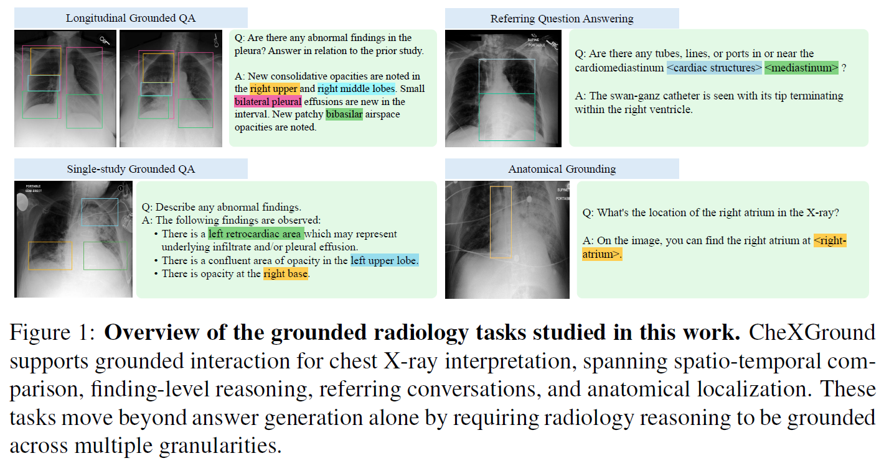
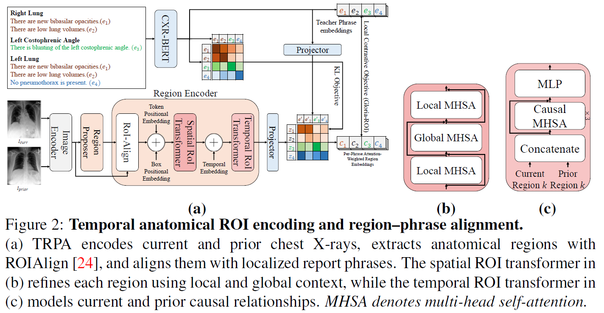
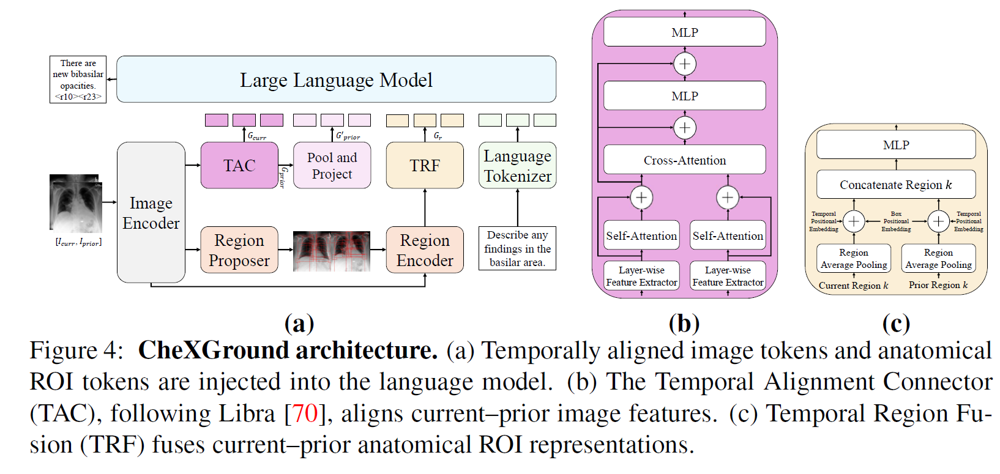

<p align="center">
  
</p>

<p align="center">
  <h1 align="center">
    <strong>CheXGround: Anatomical Region Tokens for Grounded Longitudinal Chest X-ray Interpretation</strong>
  </h1>
</p>

<p align="center">
  Adonay Demewez Gebremedhin<sup>1</sup> · Wessam Shehieb<sup>1</sup> · Sara Alansari<sup>2</sup> · Mohamad Alansari<sup>3</sup> · Muzammal Naseer<sup>3,4</sup> · Sajid Javed<sup>3</sup> · Naoufel Werghi<sup>3</sup>
</p>

<p align="center">
  <small><sup>1</sup> Ajman University, UAE · <sup>2</sup> University of Birmingham, UK · <sup>3</sup> Khalifa University, UAE · <sup>4</sup> University of Western Australia, Australia</small>
</p>

<p align="center">
  <strong>✨ BMVC 2026 ✨</strong>
</p>

## Summary

We introduce CheXGround, a region-grounded longitudinal chest X-ray language model that represents paired studies through corresponding anatomical regions. CheXGround extracts anatomical regions from current and prior radiographs, encodes them as temporally enhanced Region-of-Interest (ROI) tokens, and combines them with global temporal image context during generation. To connect these region tokens with clinical language represenations, we propose Temporal Region–Phrase Alignment, a pretraining objective that aligns temporal anatomical representations with localized report phrases.

<p align="center">
  <a href="assets/task-overview.png">
    
  </a>
</p>

<p align="center">
  <a href="assets/method-region-phrase.png">
    
  </a>
  <a href="assets/method-architecture.png">
    
  </a>
</p>

## Code

Will be released soon, stay tuned!

## Citation

```bibtex
@inproceedings{gebremedhin2026chexground,
  title     = {{CheXGround}: Anatomical Region Tokens for Grounded Longitudinal Chest X-ray Interpretation},
  author    = {Adonay Demewez Gebremedhin and Wessam Shehieb and Sara Alansari and Mohamad Alansari and Muzammal Naseer and Sajid Javed and Naoufel Werghi},
  booktitle = {British Machine Vision Conference},
  year      = {2026}
}
```
